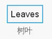
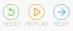
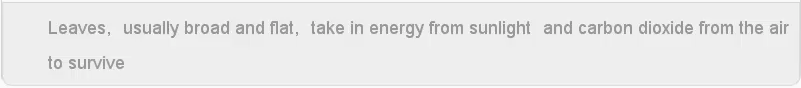
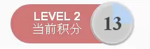

# 百词斩js题目设计
## 技术栈描述
### 引子
初看需求就知，该应用是典型的富交互应用，应用事件及状态丰富，所以单纯地pure js（vanilla）或者仅借助于操作DOM的jquery，zepto等就显得捉襟见肘（尤其是在维护方面）。所以有必要引入设计模式和组件化开发，这里选用的设计模式是[Redux](https://github.com/reactjs/redux)，组件化开发支持用的是[React](https://github.com/facebook/react)

### 组件化开发：React
#### 更简单，纯粹的组件
我更倾向于把组件化开发的关注点聚焦到__View__这一层，而不是把后端的诸如MVC的观念强行植入到前端，后端是业务驱动的，他需要接收和处理请求（Controller），有时也要持久化数据（Modal），渲染页面（View）。对于前端来说，是事件驱动的，并且主要是__交互事件（点按，拖动等）__和__网络事件（ajax等）__。在我眼中，一个组件，他只需要两类属性：
	- 行为回调：决定了当某个行为作用于组件时，组件应该如何反馈
	- 状态：决定了该组件的展示方式 
	
类似于函数式编程的纯函数（pure function）概念，我希望的组件设计也是纯组件，只要传入的属性一定，那么表现的行为就一定，这能方便我们预言和支配组件。所以，在之前的组件化实践中，我所使用的Backbone View，	Vuejs和React都是只服务于view层的。

#### 为什么选择React
由于Vue和React都有过项目实战，所以二者API的简练与否并不成为对比的条件，简洁的api设计能够帮助平缓学习曲线，但对开发效率提升不大。无论API，数据绑定方式，生态，都不成为影响该应用的因素，强行把这些区别复制过来，就显得我的设计有些“虚情假意”了。我之所以选择了React，是考虑到了能够由后端渲染的Virtual DOM，在真实项目中，该应用应该是依赖于某个题库的，为了避免题库首屏“转菊花”的过程，可以考虑后端直出第一题或前几题，提升用户体验。

### 设计模式：Redux
设计模式上，采用Redux，在腾讯的两个商业项目的实战，让我深刻感受到了Redux清晰的设计哲学。百词斩的这个应用我选用Redux主要理由如下：
	- 需求中涉及到__Redo__，Redo概括来说是一种状态回复，Redux推崇的__pure reducer__，__不可变状态__将很容易达成Redo目的。
	- Redux倡导的单一状态树让我能够非常从容的进行状态挂载，当我以一定粒度设计出一部分状态后，我只需要把这部分状态挂载到状态树上即可。当然，状态的预设计也是有条件的，就是作为程序员的我，能够得到一份健壮的交互稿，百词斩这次提供的交互足够细致（详实的视频操作说明）。
		- Redux被人诟病的样板代码（Boilerplate Code）太多并非问题，影响开发效率的我始终认为不是代码量，Redux样板代码换种视角，也意味着是__数据流动__的规范：`action => reducer`
		- Redux的reducer都力求是`pure function`，在腾讯实践的两个项目，这点大幅提升了我debug的效率，只要传入的状态和行为一直，那么页面一定会发生一定的变动。

## 设计
### 数据结构
这一部分，我将描述该应用涉及到的数据结构的设计，前端数据结构设计有助于告知后端或者介入层的童鞋如何按照规定聚合数据并返回给前端，避免前端二次聚合：
- 题目（`topic`）
	- 完整句子（`sentences`）
	- 语句块数组（`blocks`）
		- 唯一标识（`key`）
		- 位置信息（`position`）
		- 词组（`words`） 
			- 内容`title`
			- 是否高亮`highlight`
		- 描述（`desc`)
		- 关联语句（`relates`)：
			- { 关联语句的块的索引：与关联语句块之间连线的点的位置，可由设计给出}
		- 是否默认可见（`visible`）
		- 声音链接（`sound`）

比如这次应用所给定的题目就设计如下：
```js
/**
 * 题目仿真
 * @type {Array}
 */
export default {
    // 完整句子
    sentence: 'Leaves, usually broad and flat, take in energy from sunlight and carbon dioxide from the air to survive.',

    // 分块
    blocks: [
        {
            key: 1,
            words: [
                {title: 'Leaves'}
            ],
            desc: '树叶',
            position: [50, 150, 60, 195],
            relates: {},
            visible: true,
            sound: '/static/sound/1.m4a'
        },
        {
            key: 2,
            words: [
                {title: 'usually'},
                {title: 'broad'},
                {title: 'and'},
                {title: 'flat'}
            ],
            desc: '通常扁而宽',
            position: [100, 90, 325, 105],
            relates: {
                1: [[120, 150], [120, 128]] // key==>lines
            },
            sound: '/static/sound/2.m4a'
        },
        // ...
    ]
};
```

- 分数统计（`score`）
	- 当前分数（`current`）
	- 总分数（`total`）

### 组件设计
通过给定的设计稿，大致的组件设计如下：
#### 静态组件（dumb components）
静态组件是不用参与状态维护，而是“给我什么属性，我就怎么表现”的组件，由于不涉及应用状态，这部分组件的复用性较高：
- 动作按钮（`ActionButton`）
	-  样式（`className`）	
	-  点击行为（`onClick`）


- 候选语句块（`CandidateItem`）
	- 是否处于拖拽（`isDragging`）
	- 单词集合（`TextBlocks`）


- 操作面板的语句块（`DashboardBlock`）
	 - 位置信息（`position`）：将会描述语句块以及中文释义的
	 - 中文释义（`desc`）
	 - 是否被拖动元素滑过（`isOver`）
	 - 是否可见（`visible`）
	 - 与之关联的语句块（`relates`）



- 连线（`Line`）
	- 点集合（`points`）：由一系列的点集，可以决定出语句块间的连线

- 文本框（`TextBlock`）
	- 样式（`class`）
	- 词组（`words`）

- 提示图片（`Tip`）
	- 正确与否（`right`）
	- 是否可见（`visible`）


#### 容器组件（smart components）：这部分组件将耦合Redux，以获得状态，并通过`props`传递给静态组件
- 控制按钮面板（`ActionPanel`）：
	- 操作面板行为集（`actionPanelActions`）
	- 是否隐藏（`hidden`）



- 候选框（`Candidates`）:
	- 候选框行为集（`candidatesActions`）
	- 候选项（`items`）



- 操作面板（`DashBoard`）：
	- 语句块（`blocks`）
	- 是否能够播放（`play`）
	- 操作面板行为集（`dashboardActions`）


- 分数显示栏位（`Score`）:
	- 分数（`score`）
	- 分数行为集（`scoreActions`）



### 可配置项设计
将一些可能会灵活改变的参数做成配置，能方便集中化更改以降低系统的维护成本，在该应用中，设计如下参数为可配置项目：
- 拖放正确时的分数（RIGHT_SCORE）
- 拖放错误时的分数（WRONG_SCORE）
- 最大允许的错误次数（MAX_WRONG_COUNT）
- 候选语句块操作状态（CandidateStatus）
- 操作面板语句块状态（DashboardStatus）	
- 操作状态显示时间（TIP_TIME_OUT）

### 行为归纳
这一部分，将会概括整个应用涉及到的行为，以及行为的连锁反应:
- 结束放置：`END_DROP` 
	1. 判断放置正确与否
	2. 加减分
	3. 判断是否超出错误次数，如果超出，高亮提示
	4. 判断是否所有候选项都已完成
- 获得题目：`RECEIVE_TOPIC`
	1. 刷新操作面板各个语句块
	2. 刷新候选区各个候选项
- 开始播放：`PLAY` 
	1. 高亮当前播放的语句块
- 结束播放：`END_PLAY`
	1. 停止播放当前语句块
	2. 播放下一个语句块
- 重做题目：`REDO`
	1. 刷新操作面板各个语句块
	2. 刷新候选区各个候选项
- 重新播放：`REPLAY`
	- 开始播放第一个语句块
- 到下一题：`NEXT`
	- 刷新当前分数并提交
- 隐藏操作提示：`HIDE_TIP`
- 显示操作提示：`SHOW_TIP`
- 刷新当前分数：`REFRESH_CURRENT` 
- 收到分数信息：`RECEIVE_SCORE`
	- 更新分数块的显示信息

### 状态设计
最终，Redux的单一状态树及初始状态设计如下，更具体对象涉及可以参看源码：
```js
const root = {
	// 候选区域涉及的状态
	candidates: {
		items: []
	},
	
	// 操作面板涉及的状态
	dashboard: {
		blocks: [] // 语句块列表
	},

	// 共享状态
	global: {
		topic: null // 当前题目
	},

	// 分数需要的状态
	score: {
		total: null, // 总分
		current: 0 // 当前状态
	},
	
	// 提示部分需要的状态
	tip: {
		right: false, // 是否正确
		visible: false // 是否显示
	}
}
```
--------

## 分工解耦
在腾讯实习期间，我也思考怎样的设计能尽可能的进行开发解耦，这次设计中的几个方面将会形成如下的开发解耦，提升各个开发人员的工作并行率：
- 组件区分为__静态组件__及__容器组件__，将有助于将前端开发分为`生产者`和`消费者`，`生产者`将专注于撰写可复用组件，而`消费者`将专注于业务，理解状态，并使用这些组件来构成应用。
- 数据结构的设计，让设计更容易描述设计（比如直接传递位置），也解放了研发的代码难度（直接使用位置）
- 

----

## 不足：
限于时间关系，本次题目的完成主要存在如下不足：
- 未能实现拖拽靠近边界时的样式变更需求
- 性能优化没有进行，在腾讯实习期间，主要的异步优化手段有__延迟加载__，数据直出，以及利用React提供的`shouldComponentUpdate`来避免不必要的虚DOM刷新
- 录音的音源因为题目没有提供，都是本人录音上传，发音见谅

----

# 完